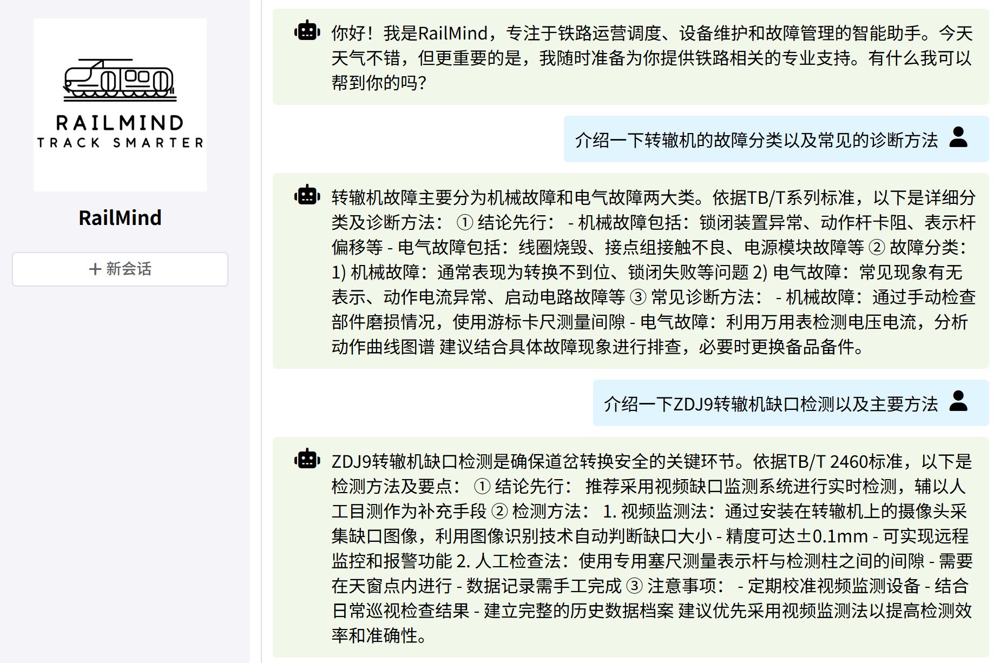

# 🛤 RailMind —— 智能铁路助手

一个基于 LangChain4j 的大模型铁路应用，专注于为铁路运营调度、设备维护和故障管理提供专业支持。

支持 知识库问答 、铁路故障记录 等核心功能，打造高效便捷的铁路运维体验。

## 🚀 1 功能亮点

- 💬 知识库问答系统 ：通过 RAG + 向量数据库(PineCone)实现精准铁路问答
- 📅 记录铁路故障 ：通过 Function Calling + MySQL 提供故障记录服务
- 🔐 对话记忆隔离与持久化 ：保障用户隐私与连续交互体验
- 🌐 多模型 API 接入 ：灵活支持多种大模型（如Qwen、DeepSeek等）
- 📊 可扩展架构设计 ：便于后续功能迭代与技术升级

## ⚙️ 2 技术栈

### 🧠 2.1 后端（Java）

- LangChain4j ：用于集成和调用大模型能力
- SpringBoot ：快速构建后端服务
- MyBatis + MySQL / MongoDB ：数据持久化层，支持关系型与非关系型数据库
- Maven ：项目依赖管理

### 🖥️ 2.2 前端（Node.js + Vue 3 + Vite）

使用现代前端框架搭建，提供友好交互界面。

## 🤖 3 效果展示

基于knife-4j的OpenAPI方式使用：

基于Vue的交互式界面使用：

## 📌 4 快速上手

请参考 [docs/quick-start.md](docs%2Fquick-start.md) 快速体验。

## 📦 5 项目结构

请参阅[docs/modules.md](docs%2Fmodules.md)。

## 📧 6 联系我们

如有任何问题（贡献代码、提出建议等），请发送邮件至：digitzh@qq.com 📨
实验室官方仓库：[同济大学计算机开放实验室](https://gitee.com/tjopenlab)

